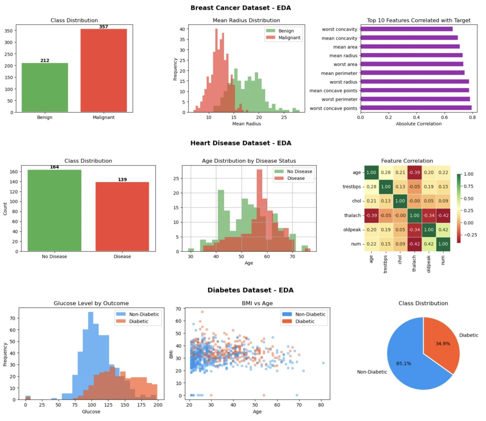
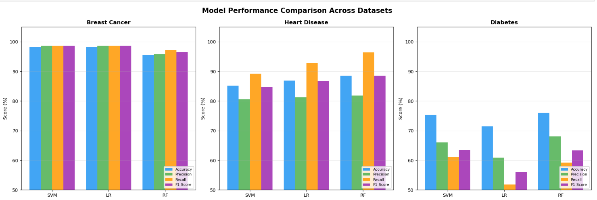
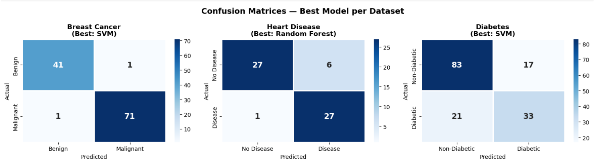
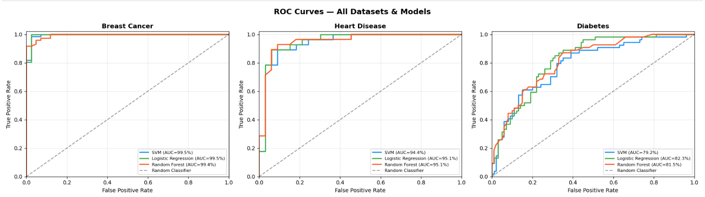
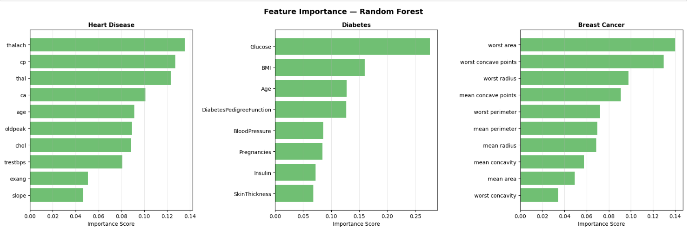
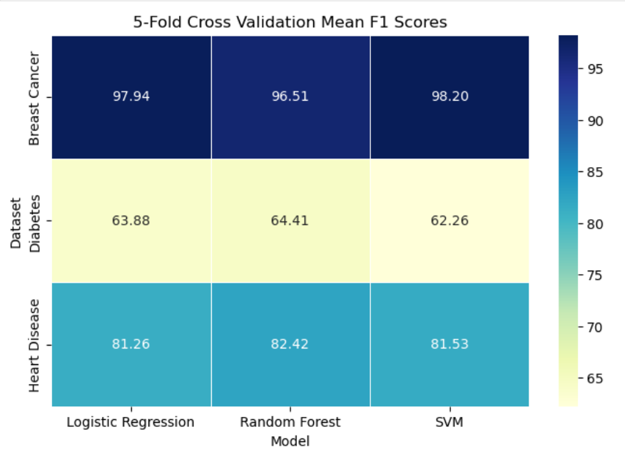
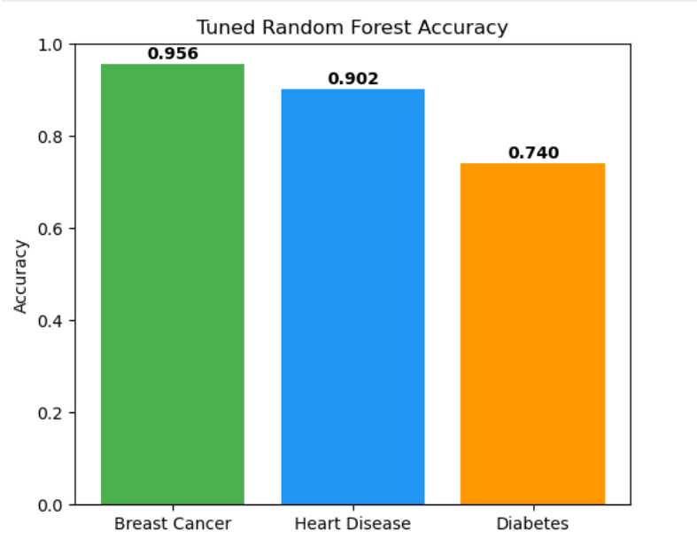

# 🩺 Disease Prediction Classification using Machine Learning

<p align="center">


</p>

---

## 📌 Overview

This project presents an end-to-end machine learning pipeline for predicting diseases using structured medical datasets. Three publicly available healthcare datasets were analyzed and multiple classification algorithms were compared to evaluate their predictive performance.

The project includes data preprocessing, exploratory data analysis, feature scaling, model training, performance evaluation, feature importance analysis, and hyperparameter tuning using GridSearchCV.

---

## 🎯 Objectives

- Predict diseases using supervised machine learning.
- Compare multiple classification algorithms.
- Evaluate model performance using standard metrics.
- Identify the most influential medical features.
- Improve Random Forest performance using GridSearchCV.

---

# 📂 Datasets

| Dataset | Source |
|----------|--------|
| Breast Cancer Wisconsin Dataset | Scikit-Learn (`load_breast_cancer`) |
| Heart Disease Dataset | UCI Machine Learning Repository (`ucimlrepo`) |
| Pima Indians Diabetes Dataset | Included in this repository (`data/diabetes.csv`) |

---

# 🤖 Machine Learning Models

The following classification algorithms were implemented and compared:

- Logistic Regression
- Support Vector Machine (SVM)
- Random Forest

Hyperparameter tuning was performed on Random Forest using GridSearchCV.

---

# 🔄 Project Workflow

```text
Data Collection
        │
        ▼
Data Preprocessing
        │
        ▼
Handling Missing Values
        │
        ▼
Exploratory Data Analysis
        │
        ▼
Feature Scaling
        │
        ▼
Train-Test Split
        │
        ▼
Model Training
(Logistic Regression | SVM | Random Forest)
        │
        ▼
Model Evaluation
        │
        ▼
Confusion Matrix
ROC Curve
Feature Importance
        │
        ▼
5-Fold Cross Validation
        │
        ▼
GridSearchCV Hyperparameter Tuning
        │
        ▼
Final Model Comparison
```

---

# 📊 Evaluation Metrics

The models were evaluated using:

- Accuracy
- Precision
- Recall
- F1 Score
- ROC-AUC Score

---

# 📈 Project Visualizations

## Exploratory Data Analysis



---

## Model Performance Comparison



---

## Confusion Matrix



---

## ROC Curve



---

## Feature Importance



---

## 5-Fold Cross Validation



---

## Tuned Random Forest Results



---

# 📌 Key Features

- Data Cleaning & Preprocessing
- Missing Value Handling
- Exploratory Data Analysis (EDA)
- Feature Scaling
- Logistic Regression
- Support Vector Machine (SVM)
- Random Forest Classification
- Model Evaluation
- Confusion Matrix Visualization
- ROC Curve Analysis
- Random Forest Feature Importance
- 5-Fold Cross Validation
- Hyperparameter Tuning using GridSearchCV

---

# 📊 Results

- Compared three supervised machine learning classification algorithms.
- Evaluated model performance on Breast Cancer, Heart Disease, and Diabetes datasets.
- Random Forest delivered the most consistent performance across all datasets.
- Breast Cancer classification achieved the highest prediction accuracy.
- Hyperparameter tuning using GridSearchCV further improved Random Forest performance.
- Feature importance analysis identified the most influential medical features contributing to disease prediction.

---

# 🛠 Tech Stack

- Python
- Pandas
- NumPy
- Matplotlib
- Seaborn
- Scikit-Learn
- Jupyter Notebook

---

# 📁 Repository Structure

```text
Disease-Prediction-Classification/

│── Disease_Prediction.ipynb
│── README.md
│── requirements.txt
│── .gitignore
├── data/
│   └── diabetes.csv

└── Images/
    ├── eda.jpeg
    ├── model_performance.png
    ├── confusion_matrix.png
    ├── roc_curve.png
    ├── feature_importance.png
    ├── 5-fold_cv.png
    ├── tuned_random_forest.png
    └── models_result.png
```

---

# 🚀 Installation

Clone the repository

```bash
git clone https://github.com/your-username/Disease-Prediction-Classification.git
```

Move into the project directory

```bash
cd Disease-Prediction-Classification
```

Install dependencies

```bash
pip install -r requirements.txt
```

Launch Jupyter Notebook

```bash
jupyter notebook
```

Open

```
Disease_Prediction.ipynb
```

---

# 🔮 Future Improvements

- Develop a web application using Streamlit.
- Explore additional ensemble learning methods.
- Incorporate explainable AI techniques such as SHAP.
- Evaluate the models on larger and more diverse healthcare datasets.

---

# 👩‍💻 Author

**Avni Srivastava**

If you found this project useful, consider giving it a ⭐ on GitHub.
